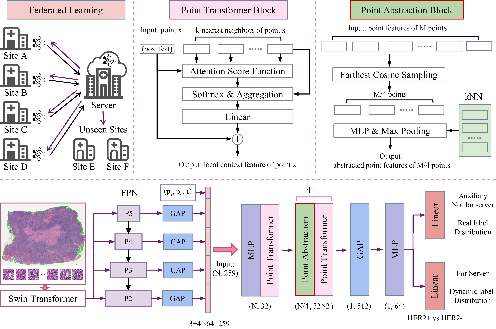

# Point Transformer with Federated Learning for Predicting Breast Cancer HER2  Status from Hematoxylin and Eosin-Stained Whole Slide Images


## PointTransformerDDA+

The overall framework of PointTransformerDDA+.




## Environment Settings


```bash
conda create --name point python=3.8
conda activate point
# pytorch 1.12.0 with cuda 11.3
conda install pytorch==1.12.0 torchvision==0.13.0 torchaudio==0.12.0 cudatoolkit=11.3 -c pytorch
# compared graph model are implemented by DGL
conda install -c dglteam/label/cu113 dgl=1.0.2
pip install -r requirements.txt
```


## Run Experiments

Demo for debug the model. We put some point data from public HEROHE dataset in the HER2 directory 

```bash
# Training using HEROHE and with external dataset HER2C
python main_her2_FL.py --max_epochs 200 --batch_size 4 --fl_avg FedAvg --exp_code fed_avg_demo --aux 1.0 --csv_path dataset_csv/HEROHE_HER2.csv --data_dir HER2 --ind_name her2c
```

We recommend to use wandb to visualize the model's training progress. To use wandb, please add the argument ```--wandb``` in the command line


```bash
python main_her2_FL.py --max_epochs 200 --batch_size 32 --fl_avg FedAvg --exp_code fed_avg_demo --aux 1.0 --fast_sim --csv_path data_csv/HEROHE_HER2.csv --ind_name her2c --wandb
```


Experiments runed in our study, need the whole data.

```bash
# Centralized Training
python main_her2_FL.py --exp_code central_baseline --no_fl
# Base PointTransformer
python main_her2_FL.py --fl_avg FedAvg --exp_code PointTransformer
# PointTransformer with FCS
python main_her2_FL.py --fl_avg FedAvg --exp_code PointTransformer+ --fast_sim
# PointTransformer with DDA
python main_her2_FL.py --fl_avg FedAvg --exp_code PointTransformerDDA --aux 1.0
# PointTransformer with FCS and DDA
python main_her2_FL.py --fl_avg FedAvg --exp_code PointTransformerDDA+ --aux 1.0 --fast_sim
```

## Reference By
[qq456cvb/Point-Transformers](https://github.com/qq456cvb/Point-Transformers)<br>
[mahmoodlab/HistoFL](https://github.com/mahmoodlab/HistoFL)

## Cite
If it is helpful for your work, please cite this paper:
```tex
@misc{li2023point,
      title={Point Transformer with Federated Learning for Predicting Breast Cancer HER2 Status from Hematoxylin and Eosin-Stained Whole Slide Images}, 
      author={Bao Li and Zhenyu Liu and Lizhi Shao and Bensheng Qiu and Hong Bu and Jie Tian},
      year={2023},
      eprint={2312.06454},
      archivePrefix={arXiv},
      primaryClass={eess.IV}
}
```